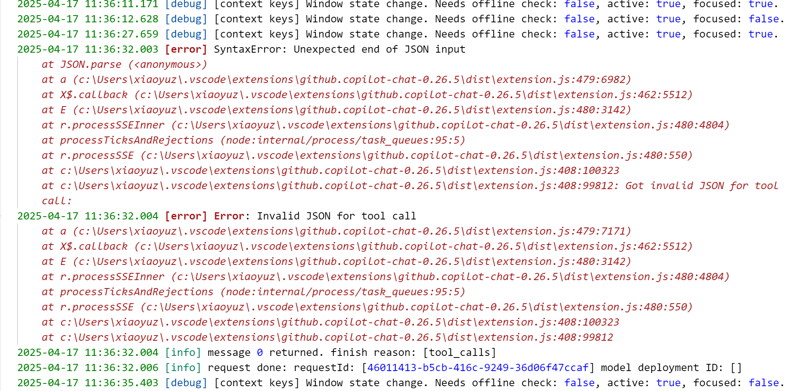

This repo contains a minimal reproduce example for the bug when consuming vscode lm api with claude 3.5

## Steps to reproduce
- Clone, build and run the repo
- In extension host, enable `trace` level logging under `Developer: Set Log Level` in the command palette
- In extension host, Go to `GitHub Copilot Chat` Output channel
- In extension host, run `run_llm_with_tool_call` command, you will see the following error message

